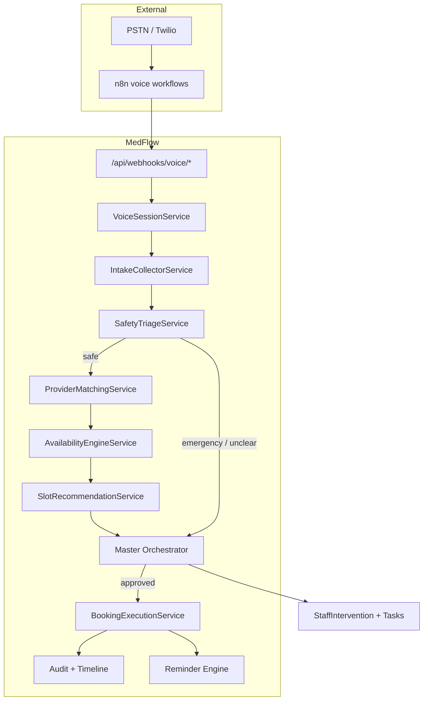

# Phase 9 — Architecture: Inbound AI scheduling

**Planning only.** This document describes target architecture; it does not enable live scheduling.

## Goals

1. Professional inbound voice intake with client identification or creation  
2. Structured collection of visit reason, symptoms/needs, urgency, preferences  
3. **Safety triage** — emergency pathway, no normal booking when risk is high  
4. Provider/nurse matching by skills, specialty, gender preference, load, availability  
5. Slot recommendation with clinic rules (hours, buffers, capacity)  
6. Booking via orchestrator-approved proposals with timeline + audit + reminders  
7. Human handoff when confidence, availability, or risk requires staff  

## Non-goals (Phase 9 planning)

- Clinical diagnosis or treatment recommendations  
- Live EHR integration  
- Guaranteed optimal medical routing (heuristic matching only)  
- Insurance adjudication or payment capture  

## System context

## Layer responsibilities

| Layer | Responsibility | Existing code to extend |
|-------|----------------|-------------------------|
| **Voice ingress** | Call SID, DTMF/speech events, session state | `CallLog`, webhooks, `VOICE_CALL_AI` |
| **Intake** | Collect & validate fields; idempotent client upsert proposal | `Client`, `INTAKE_AI` |
| **Safety triage** | Emergency keywords, urgency enum, block booking | `detectEmergencyLanguage`, `master-orchestrator` emergency flow |
| **Provider directory** | Nurse/provider profiles, skills, capacity | *New models* (see DATA-MODEL-PLAN) |
| **Matching** | Score candidates; explain match | *New service* |
| **Availability** | Working hours, buffers, conflicts | *New service*; reads `Appointment` |
| **Slots** | Ranked offers to caller | *New service* |
| **Orchestration** | All mutations as `AgentAction` proposals | `master-orchestrator.service.ts` |
| **Booking** | Create `Appointment`, assign provider | Extend `Appointment.providerUserId` |
| **Comms** | Confirmation SMS/email (mock/live) | Phase 6 integrations |
| **Governance** | High-risk hold, staff override | Phase 8 audit + existing override fields |

## Session state machine (voice)

Planned states (persisted in `SchedulingCallSession` — see data model):

| State | Description |
|-------|-------------|
| `GREETING` | AI disclosure + clinic greeting |
| `IDENTIFY_CLIENT` | Lookup by phone/DOB or create profile |
| `COLLECT_INTAKE` | Reason, symptoms, urgency, preferences |
| `SAFETY_TRIAGE` | Emergency scan; may branch to `ESCALATED` |
| `MATCH_PROVIDER` | Run matching engine |
| `OFFER_SLOTS` | Present 2–3 slots; accept/reschedule loop |
| `CONFIRM_BOOKING` | Build orchestrator proposal |
| `COMPLETED` | Booked or handed off |
| `ESCALATED` | Staff intervention; automation halted |
| `ABANDONED` | Timeout / hang-up |

## Integration boundaries

### Master Orchestrator (mandatory)

All writes flow through proposals:

- `PROPOSE_CLIENT_UPSERT`  
- `PROPOSE_APPOINTMENT_BOOK`  
- `PROPOSE_STAFF_INTERVENTION`  
- `HALT_AUTOMATION` on emergency  

Voice agent **never** calls Prisma directly for appointments.

### n8n (optional transport)

n8n may handle telephony STT/TTS; MedFlow remains **system of record** for clients, appointments, audit. Webhooks authenticate via `webhook-auth.ts` (Phase 6/8).

### Reminder engine

After successful book, enqueue reminder schedule (Phase 5) unless `reminderAutomationPaused` on appointment.

## Deployment notes

- `MOCK_MODE=true` for voice/scheduling stubs until credentials configured  
- PHI: transcript storage policy — metadata + redacted summary in audit; full transcript access RBAC-restricted  
- Timezone: `America/Chicago` for slot boundaries (clinic config table planned)  

## Related

- [WORKFLOWS.md](./WORKFLOWS.md)  
- [DATA-MODEL-PLAN.md](./DATA-MODEL-PLAN.md)  
- [GOVERNANCE.md](./GOVERNANCE.md)  
