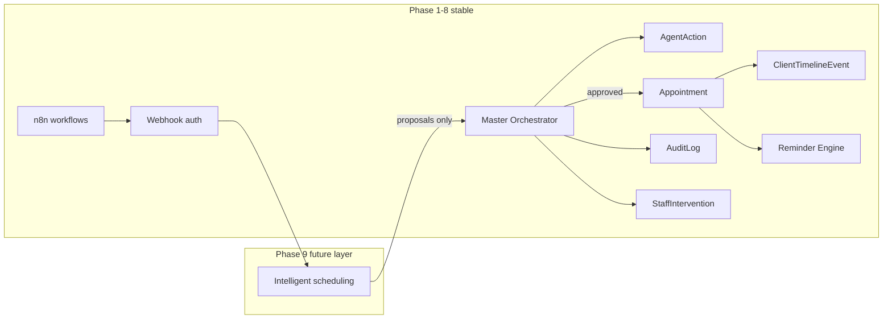

# Phase 9 — Coordination with existing MedFlow systems

How **Intelligent Inbound Call Scheduling** connects to Phase 1–8 without replacing or breaking stable workflows.

## Coordination principles

## Per-system integration

### Master Orchestrator

All inbound scheduling mutations call `masterOrchestratorService.submitProposal` / `reviewProposal` — never direct Prisma writes from voice or matching layers.

| Aspect | Rule |
|--------|------|
| Entry | All scheduling mutations are `AgentAction` proposals |
| Agents | `VOICE_CALL_AI`, `INTAKE_AI`, `APPOINTMENT_AI`, `ESCALATION_AI` |
| Approval | Auto only for L0/L1 low-risk; L2+ staff review |
| Halt | `HALT_AUTOMATION` on emergency — same pattern as today |
| Implementation | Extend `master-orchestrator.service.ts` — **do not** bypass in Phase 9 planning |

**Planned proposal types:** `PROPOSE_CLIENT_UPSERT`, `PROPOSE_SCHEDULING_INTAKE`, `PROPOSE_PROVIDER_MATCH`, `PROPOSE_APPOINTMENT_BOOK`.

### AgentAction

- `proposedPayload` carries structured intake, match scores, slot ISO times — sanitized at audit boundary.  
- `callLogId` links voice session to proposal chain.  
- `isEmergency` / `automationHalted` reuse existing flags.  
- Cross-session: proposals keyed by `clientId` + `schedulingSessionId` to avoid duplicate books.

### Appointment

- Phase 9 build adds `providerUserId`, `serviceTypeId`, `urgencyLevel`, `bookedVia`, `schedulingSessionId`.  
- Existing statuses (`SCHEDULED`, `CONFIRMED`, …) unchanged.  
- Reminder engine reads `scheduledAt`, `reminderAutomationPaused` — no change to Phase 5 contract.  
- Walk-in / physical check-in flows **do not** use intelligent scheduling path unless staff initiates.

### ClientTimelineEvent

| Event | When |
|-------|------|
| `APPOINTMENT_CREATED` | After approved book |
| `EMERGENCY_DETECTED` | Safety triage halt |
| `AGENT_PROPOSAL_*` | Orchestrator lifecycle |
| `STAFF_INTERVENTION_CREATED` | Handoff |

Timeline descriptions must not embed raw PHI (Phase 8 redaction).

### AuditLog

| Action | Entity |
|--------|--------|
| `CREATE` / `UPDATE` | `SchedulingCallSession`, `SchedulingRecommendation` |
| `CREATE` | `Appointment`, `StaffIntervention` |
| `VIEW` | Client lookup during identify step |

Use `sanitizeMetadataForAudit()` — symptom text stays in secured intake store.

### StaffIntervention

| Status | Use |
|--------|-----|
| `URGENT` | Emergency pathway |
| `STAFF_REVIEW_REQUIRED` | High-risk / low confidence book hold |
| `AI_ESCALATED` | Handoff from voice agent |
| `HUMAN_TAKEOVER` | Caller requested human |

Staff dashboard queue (future UI) reads interventions — no change to Phase 4 API contract in planning.

### Reminder engine

After `Appointment` create:

1. Check `reminderAutomationPaused`  
2. Enqueue T-48h / T-24h / T-2h / T-30m per Phase 5  
3. `ReminderLog` outcomes unchanged  

Intelligent scheduling **must not** send reminders directly — only propose comms via orchestrator.

### n8n workflows

| Pattern | Coordination |
|---------|--------------|
| Inbound voice | n8n may forward Twilio events → MedFlow webhook (Phase 6/7) |
| System of record | MedFlow owns `Client`, `Appointment`, audit |
| Templates | Phase 7 JSON unchanged; optional new workflow `inbound-scheduling` in future |
| Auth | `WEBHOOK_SECRET` / Twilio signature — no session RBAC |

### Webhook security

- `/api/webhooks/*` remains machine-to-machine.  
- Scheduling session endpoints (future) live under webhooks or authenticated API — planning defers choice; **must** pass `audit:production` webhook rules.

### AI agent collaboration

| Agent | Role in scheduling |
|-------|-------------------|
| `VOICE_CALL_AI` | Call flow, slot presentation |
| `INTAKE_AI` | Client identify / intake proposals |
| `APPOINTMENT_AI` | Book / reschedule proposals |
| `ESCALATION_AI` | Intervention + halt |
| `MASTER_ORCHESTRATOR` | Approve / reject / escalate only |

Agents do not call each other directly — only orchestrator routes.

### MOCK_MODE & provider abstraction

- Voice/SMS/email/calendar calls go through Phase 6 integration layer.  
- Planning validation runs with `MOCK_MODE=true` — no live traffic.  
- `intelligent-scheduling.service` orchestrates **proposals**, not provider HTTP clients directly.

## Session vs cross-session coordination

| Scope | Mechanism |
|-------|-----------|
| **Within session** | `SchedulingCallSession.status` state machine; single active proposal chain per session |
| **Across sessions** | DB constraints on `Appointment` overlap; orchestrator rejects duplicate `PROPOSE_APPOINTMENT_BOOK` for same slot |
| **Across agents** | Single orchestrator queue per `clientId` for conflicting writes |

## What Phase 9 planning does NOT touch

- `src/middleware/*` RBAC matchers  
- `reminder-engine.service.ts` logic  
- `n8n-workflows/*.json`  
- `webhook-auth.ts`  
- Prisma migrations  
- Dashboard pages  
- Existing audit scripts (except optional static doc checks)  

See [ROADMAP.md](./ROADMAP.md) for milestone order.
