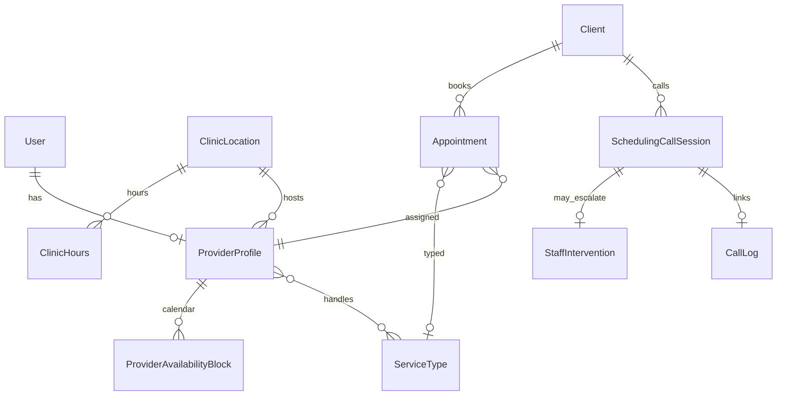

# Phase 9 — Data model plan (not migrated)

Proposed Prisma additions. **Do not apply until implementation phase.** Names may change during review.

## Extensions to existing models

### `Appointment` (extend)

| Field | Type | Notes |
|-------|------|-------|
| `providerUserId` | `String?` → `User` | Replaces free-text `providerName` over time |
| `serviceTypeId` | `String?` → `ServiceType` | Visit type for matching |
| `urgencyLevel` | `SchedulingUrgency` | From intake |
| `bookedVia` | `BookingSource` | `VOICE_AI`, `STAFF`, `WALK_IN`, … |
| `schedulingSessionId` | `String?` | Link to call session |
| `requiresStaffReview` | `Boolean` | High-risk holds |
| `matchScore` | `Float?` | Audit/debug only; not shown to patient |

Keep `providerName` for display backward compatibility during migration.

### `CallLog` (extend metadata contract)

Structured `metadata` JSON schema (documented, not enforced by DB):

```json
{
  "schedulingSessionId": "cuid",
  "intakeComplete": true,
  "transcriptRef": "storage-key-or-stub",
  "redactedSummary": "Patient requested follow-up for ...",
  "orchestratorProposalIds": ["..."]
}
```

### `AgentAction` (new `actionType` values — application enum)

Planned proposal types (string `actionType`):

- `PROPOSE_CLIENT_UPSERT`  
- `PROPOSE_SCHEDULING_INTAKE`  
- `PROPOSE_PROVIDER_MATCH`  
- `PROPOSE_APPOINTMENT_BOOK`  
- `PROPOSE_SLOT_HOLD` (optional short TTL hold)  

## New enums

```prisma
enum SchedulingUrgency {
  ROUTINE
  SOON
  URGENT
  EMERGENCY
}

enum BookingSource {
  STAFF
  VOICE_AI
  SMS_AI
  WALK_IN
  N8N
}

enum ProviderProfileStatus {
  ACTIVE
  INACTIVE
  ON_LEAVE
}

enum SchedulingCallSessionStatus {
  GREETING
  IDENTIFY_CLIENT
  COLLECT_INTAKE
  SAFETY_TRIAGE
  MATCH_PROVIDER
  OFFER_SLOTS
  CONFIRM_BOOKING
  COMPLETED
  ESCALATED
  ABANDONED
}

enum GenderPreference {
  NO_PREFERENCE
  FEMALE
  MALE
  NON_BINARY
}
```

## New models

### `ClinicLocation`

| Field | Type |
|-------|------|
| id | cuid |
| name | String |
| timezone | String @default("America/Chicago") |
| address fields | optional |
| isActive | Boolean |

### `ServiceType`

Catalog of visit reasons the clinic schedules (not ICD codes).

| Field | Type |
|-------|------|
| id | cuid |
| code | String @unique |
| displayName | String |
| defaultDurationMinutes | Int |
| bufferBeforeMinutes | Int |
| bufferAfterMinutes | Int |
| requiresStaffReview | Boolean |
| allowedUrgencyMax | SchedulingUrgency |

### `ProviderProfile`

Links `User` (clinical staff) to scheduling capabilities.

| Field | Type |
|-------|------|
| id | cuid |
| userId | String @unique → User |
| displayName | String |
| gender | String? |
| roleTitle | String |
| specialty | String |
| skills | String[] |
| serviceTypeIds | relation M2M |
| clinicLocationId | String |
| maxDailyAppointments | Int |
| status | ProviderProfileStatus |
| metadata | Json? |

### `ProviderAvailabilityBlock`

Recurring or one-off availability (not yet booked).

| Field | Type |
|-------|------|
| id | cuid |
| providerProfileId | String |
| dayOfWeek | Int? (0–6) |
| startTime | String (HH:mm local) |
| endTime | String |
| specificDate | DateTime? |
| isBlocked | Boolean (PTO / meeting) |
| clinicLocationId | String |

### `ClinicHours`

Default open hours per location / day.

| Field | Type |
|-------|------|
| clinicLocationId | String |
| dayOfWeek | Int |
| openTime | String |
| closeTime | String |
| isClosed | Boolean |

### `SchedulingCallSession`

Voice intake state container.

| Field | Type |
|-------|------|
| id | cuid |
| callLogId | String? → CallLog |
| clientId | String? |
| status | SchedulingCallSessionStatus |
| intakePayload | Json |
| matchResult | Json? |
| offeredSlots | Json? |
| selectedSlot | Json? |
| confidenceScore | Float? |
| automationHalted | Boolean |
| staffInterventionId | String? |
| expiresAt | DateTime |

### `ProviderMatchDecision` (audit artifact)

| Field | Type |
|-------|------|
| id | cuid |
| sessionId | String |
| rankedProviderIds | Json |
| selectedProviderId | String? |
| scores | Json |
| reasonCodes | String[] |
| createdAt | DateTime |

## Entity relationship (planned)



## Migration strategy (when implementing)

1. Add enums + `ClinicLocation`, `ServiceType`, seed defaults  
2. Add `ProviderProfile` + availability (seed 2–3 demo providers)  
3. Add `SchedulingCallSession`  
4. Extend `Appointment` with FK to provider (nullable; backfill `providerName`)  
5. Add indexes: `(providerUserId, scheduledAt)`, `(status, scheduledAt)`  

## Indexing & performance

- Availability queries: `(providerProfileId, specificDate)` + appointment overlap check on `scheduledAt` + `durationMinutes`  
- Session lookup: `(callLogId)` unique where not null  

## PHI considerations

- `intakePayload` may contain symptoms — encrypt at rest if required by policy; minimum: redact in audit metadata (Phase 8)  
- Do not duplicate full transcript in `AuditLog.metadata`  
