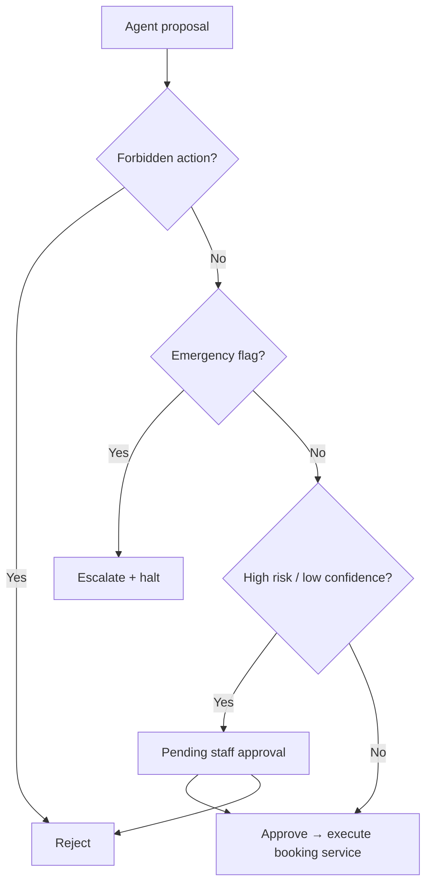

# Phase 9 — Governance & safety

Planning rules for inbound AI scheduling. Complements Phase 8 HIPAA-conscious controls.

## Principles

1. **AI is not a clinician** — no diagnosis, no treatment advice, AI identity disclosed on every call opening.  
2. **Orchestrator gate** — no direct DB writes from voice/intake agents.  
3. **Staff override wins** — any staff action supersedes AI proposals in flight.  
4. **Auditable decisions** — match scores, slot offers, approvals, and handoffs logged without PHI in metadata.  
5. **Emergency ≠ scheduling** — emergency pathway never completes a routine booking in the same session.  

## Risk tiers

| Tier | Examples | Automation |
|------|----------|------------|
| **L0 Routine** | Follow-up, established patient, ROUTINE urgency | Auto-book after orchestrator if match confidence ≥ threshold |
| **L1 Soon** | New symptom, SOON urgency | Auto-book if provider matched + slots valid |
| **L2 Urgent** | Urgent but non-emergency language | Proposal requires staff approval before book |
| **L3 Emergency** | Emergency keywords / policy triggers | Halt automation; staff + 911 guidance only |
| **L4 Clinical boundary** | Treatment/diagnosis questions | Handoff; block AI clinical content (Phase 8 `ai-safety.ts`) |

`ServiceType.requiresStaffReview` forces **L2 minimum**.

## Orchestrator proposal flow

## Staff override

Reuse existing patterns:

- `Appointment.staffOverride*` fields  
- `StaffIntervention` with status `STAFF_REVIEW_REQUIRED` or `URGENT`  
- `StaffTask` for callback scheduling  

Staff dashboard (future UI): queue of pending scheduling proposals.

## Audit requirements

| Event | AuditAction | Entity |
|-------|-------------|--------|
| Intake completed | CREATE | SchedulingCallSession |
| Match computed | CREATE | ProviderMatchDecision |
| Slots offered | UPDATE | SchedulingCallSession |
| Proposal submitted | CREATE | AgentAction |
| Book executed | CREATE | Appointment |
| Export transcript access | FILE_ACCESS | CallLog |
| Emergency | CREATE | EmergencyFlow / StaffIntervention |

Metadata: use `sanitizeMetadataForAudit()` — symptom text stays in secured intake store, not audit JSON.

## AI agent permissions (planned)

| Agent | May propose | May not |
|-------|-------------|---------|
| VOICE_CALL_AI | intake, match request, slot hold, book, escalate | direct send without approval |
| INTAKE_AI | client upsert, intake log | book |
| APPOINTMENT_AI | book, reschedule | bypass orchestrator |
| ESCALATION_AI | intervention, halt | book while halted |

Extend `src/lib/agents/definitions.ts` when implementing — do not broaden permissions in planning phase.

## Compliance disclaimer

Phase 9 scheduling automation does not imply HIPAA compliance. Organizational BAAs, policies, and training remain required (see `docs/HIPAA-CONSCIOUS.md`).
