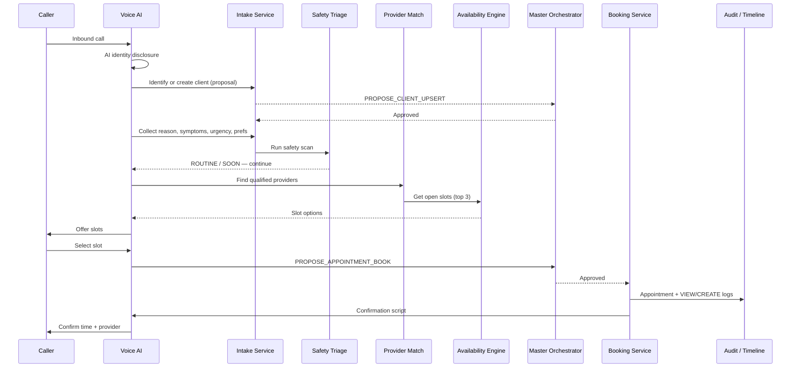
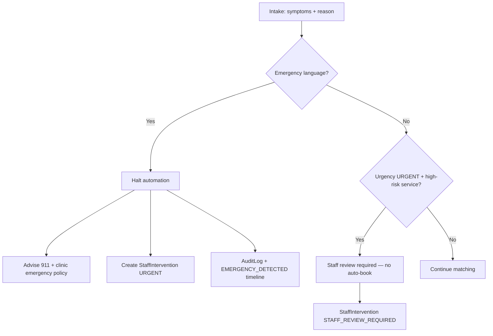
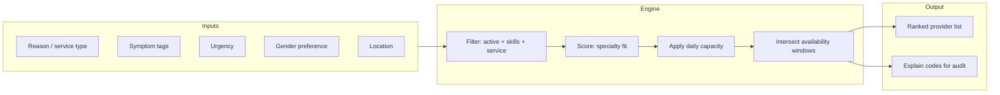
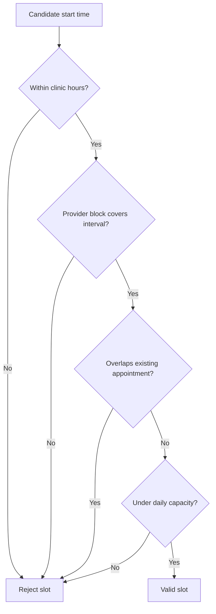
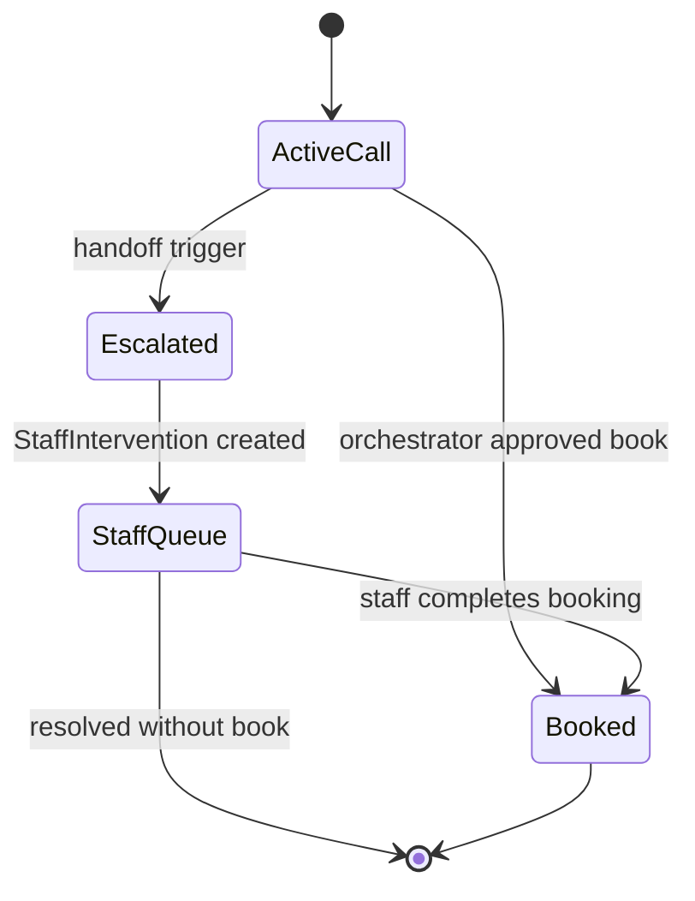

# Phase 9 — Workflows

Planning diagrams for inbound AI scheduling. **Not implemented.**

## 1. Inbound call — happy path

## 2. Safety triage — emergency branch

**Note:** Triage detects **routing risk**, not medical diagnosis. Copy is policy-driven templates, not clinical assessment.

## 3. Provider matching

### Scoring dimensions (planned weights — tunable)

| Factor | Weight idea |
|--------|-------------|
| Service type match | High |
| Skill tag overlap | High |
| Available slot within preference window | Medium |
| Gender preference match | Medium (soft) |
| Current day load vs maxDaily | Medium |
| Specialty keyword match | Low–medium |

## 4. Calendar availability

Before offering a slot:

1. Resolve clinic `ClinicHours` for date  
2. Load `ProviderAvailabilityBlock` (+ subtract blocks marked `isBlocked`)  
3. Query existing `Appointment` where `status` not in (`CANCELLED`, `NO_SHOW`, `WALK_OUT`)  
4. For each candidate start time:  
   - `durationMinutes` from `ServiceType`  
   - Add buffer before/after  
   - Ensure end ≤ clinic close  
   - Ensure provider count < `maxDailyAppointments`  

## 5. Slot recommendation

Agent offers **only** slots passing validation. Presentation rules:

- Offer 2–3 options, earliest acceptable first  
- Respect preferred time window when possible  
- If no slot in window, explain and offer nearest alternatives  
- Never offer double-booked intervals  

## 6. Booking confirmation

On client selection (post-orchestrator approval):

| Step | System action |
|------|----------------|
| 1 | `Appointment.create` with `providerUserId`, `serviceTypeId`, `urgencyLevel` |
| 2 | `ClientTimelineEvent` `APPOINTMENT_CREATED` |
| 3 | `AuditLog` `CREATE` |
| 4 | Reminder schedule (Phase 5) unless paused |
| 5 | Optional `PROPOSE_SEND_SMS` / email confirmation |
| 6 | Update `CallLog.metadata` with redacted summary + session link |

## 7. Human handoff triggers

| Trigger | Action |
|---------|--------|
| Emergency symptoms | Halt + 911 script + urgent intervention |
| Unclear symptoms / low confidence | `STAFF_REVIEW_REQUIRED` |
| No provider match | Staff task + callback proposal |
| No availability | Offer waitlist proposal (future) or staff callback |
| Client asks for human | Immediate handoff |
| Insurance/payment issue | Front desk / billing staff task |
| High-risk service type | Booking proposal held for staff approval |

## 8. Governance checkpoints

See [GOVERNANCE.md](./GOVERNANCE.md).
